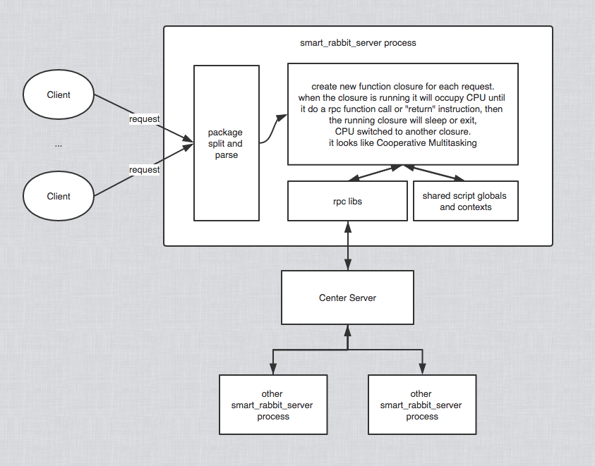

# SmartRabbitServer
SmartRabbitServer is a lightweight server, the server contains a series of server libs. It is single threaded with muti-task scripts, but can also be easily deployed to multiple processes 

It is written by C

1. C as the core
2. make-sweep GC algorithem to manager memory
3. script vm inside so you can write your server logic easily with a lua-like script language
4. adobe amf3 as the transport protocol , so it can be easily intergrated with flash web client, but if you don't like it, you can changed it with any protocol you want, code is clear

